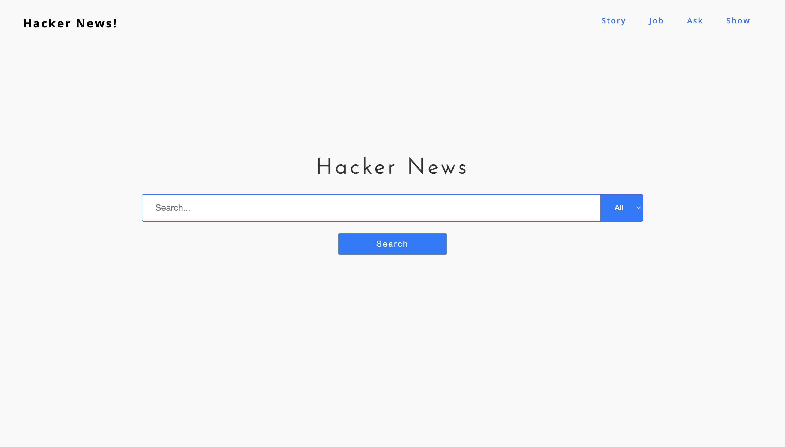

## Project Overview
The Django-based Hackernews application has been designed to regularly collect information from the Hackernews API asynchronously using Celery. Additionally, the application includes pages that allow users to view the gathered data while also providing filtering options for more efficient data retrieval.

## Demo



## Getting Started

### Requirements

**Python3.10 and above**
To install python, please follow the documentation on the official download site https://www.python.org/downloads/

**Redis**
Install Redis on the following OS

MAC: https://developer.redis.com/create/homebrew/

Linux: https://developer.redis.com/create/linux/

Windows: https://developer.redis.com/create/windows

To run the redis-server once installed:
```
$ redis-server
```

### Setup
**Clone the repository**
```
git clone https://github.com/adebisit/hacker-news-app.git
cd hacker-news-app
```

**Setup virtual environment**

Set up virtual enviroment and install requirements using python-venv.
```
$ python3 -m venv venv
$ source venv/bin/activate
$ pip install -r requirements.txt
```

**Environment Variables**
Create a `.env` file to store the enviroment variables. They are listed below;
```
$ touch .env
$ echo SECRET_[KEY=your_secret_key] >> .env
$ echo DEBUG=[your_debug_value] >> .env
```
| Env Var | Description |
|---------|-------------|
|`SECRET_KEY`| Generate a secret key for your application with Djecrety[https://djecrety.ir/]|
| `DEBUG` |Set local development, set to `TRUE`. For production, set to `FALSE`|

**Migrate Database**

Because the application uses sqlite, running the following command will create the `db.sqlite` file automatically.

```
$ python manage.py migrate
```

## Running The application

Start the Redis Server:

```
$ redis-server
```

Start the Celery Server:

```
$ celery -A hackernews worker -l info
```

Run Django App

```
$ python manage.py runserver
```

### Usage
By default, there is no data on the databas, therefore, pages will return no data. The Tasks found in `news/tasks.py` file can be passed to the celery worker to populate the database to the most recent post available on Hacker News API. Do note however, that running this will take a substancial amount of time.

```
$ python manage.py shell
$ from news import tasks
$ tasks.get_history.delay() -> sends to celery worker to get previous data (up to 500 $ previous posts)
$ tasks.getlatest.delay()
```
At any point, you can run these functions to get the most recent data from hacker news api.


## Features
| Feature | Description |
|------------|------------|
| Hacker News Display | Views recent posts from Hacker News |
| Add Custom News | Integrate custom news info independent of hacker news |
| Filter | Perform Filter on display pages |

## Technologies Used
List the key technologies, libraries, and frameworks used in your project.
* Django
* Celery
* HTML, CSS & Vanilla Javascript


**Contributing**
* Implement Celery Auto Scheduler to run news tasks functions perodically.